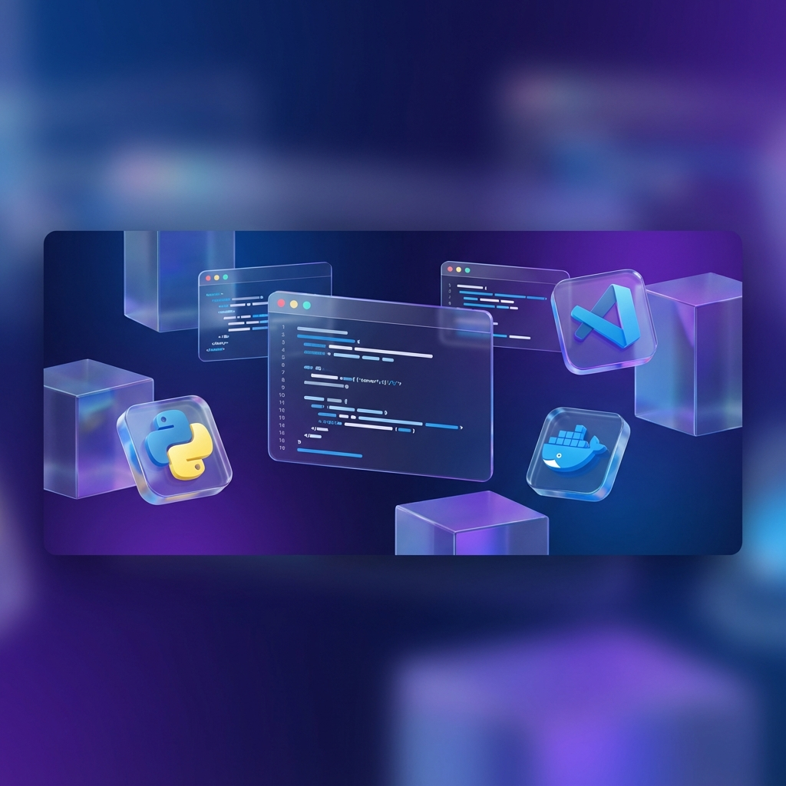

# DevStack Setup Guide 🚀

プログラミング初心者向けの、モダンで視覚的な環境構築ガイドです。
Python, Node.js, VSCode, Git, Docker, MT4/5, MQLなど、開発に必要なツールの導入手順をステップバイステップでやさしく解説します。

<div align="center">
  
</div>

## ✨ 特徴

- **モダンでプレミアムなUI**: グラスモルフィズム、滑らかなアニメーション、洗練されたタイポグラフィを採用。
- **初心者フレンドリーな解説**: 難しい用語を避け、図解やお役立ちヒント、ハマりやすい注意点を豊富に掲載。
- **進捗管理機能**: 各ステップにチェックボタンを設け、プログレスバーで進行状況をリアルタイムに可視化。
- **スムーズな学習体験**: 「次へ進む」ナビゲーションにより、ツールの導入順序を迷わせません。

## 🛠️ 技術スタック

- **React 19**
- **Vite**
- **Tailwind CSS**
- **Lucide Icons** (Custom SVG implementation)

## 🚀 ローカルでの動かし方

### 1. 依存関係のインストール

```bash
npm install
```

### 2. ローカルサーバーの起動

```bash
npm run dev
```

起動後、ブラウザで表示されたURL（通常は `http://localhost:5173`）にアクセスしてください。

## 📂 プロジェクトの構成

- `components/`: UIの部品（HomeView, Sidebar, ManualViewer, StepCard等）
- `data/manuals.ts`: マニュアルのコンテンツ（テキストデータ）
- `types.ts`: TypeScriptの型定義
- `index.css`: カスタムアニメーションや特殊スタイル定義
- `public/`: 画像アセット等

## 📝 使い方

1. **ホーム画面**: 全体像を把握し、必要なカテゴリーからマニュアルを選択します。
2. **ステップ実行**: 各手順に従って作業し、完了したら「完了にする」をクリックします。
3. **進行状況**: 上部のプログレスバーで現在の進捗を確認できます。
4. **次のステップ**: 全てのステップを完了すると、次に導入すべきツールへの案内が表示されます。

---

Developed with ❤️ for developers starting their journey.
